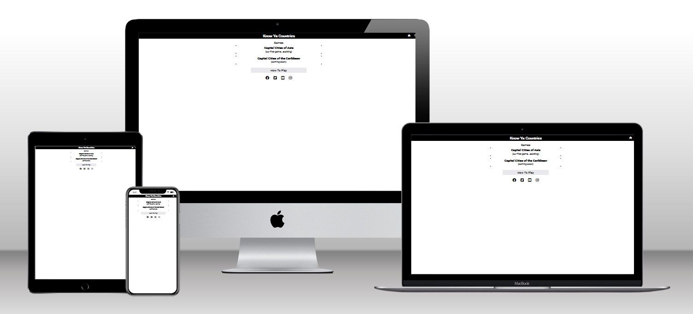
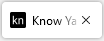
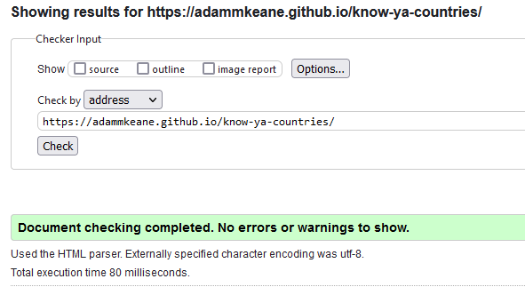

# Know Ya Countries

This website aims to provide a convenient place to find all the relevant info about Irelands's 2022 rugby tour of New Zealand. I found that I was searching for a few different wesbites to find information about the tour, so this website aims to bring all the sites I wanted into one place. Hopefully, others will also find the sites I looked for of interest to them, and they can use this site to save them time searching for that info themselves. 

The target audience for this site would be rugby fans, or even sports fan more widely. This was quite an historic tour, potentially Ireland's greatest ever sporting acheivement, so it may have a wider appeal than die-hard rugby fans.

View the live site [here.](https://adammkeane.github.io/nz-ire-2022/)



## Features

### Site wide
* Navigation Menu
    * Contains links to the Home, the three Test Match and Sign Up pages, and will be responsive on all devices.
    * This will allow users to easily navigate between the pages within the site on any size device. 
    * Uses an expandable and contractable hamburger menu design to allow it to be hidden when not needed.

Nav Menu Open


Nav Menu Closed


* Footer
    * This will contain icons as links to social media websites that will open in new tabs. 
    * Icons will be accessible to the visually impaired who may be using a screen reader, by the use of aria labels.
    * This will allow users to a way follow our social media content and stay up to date with our porjects.


* Favicon
    * A site wide favicon has been implemented with a custom emblem.
    * This will provide an image in the the tabs header to allow the user to easily identify the website if they have multiple tabs open.



* Custom 404 Page
    * A custom 404 page was implemented and will display if a user navigates to a broken link.
    * A link is also provided back to the website's home page. This allows users to understand what went wrong and get them back to where they want to be.


### Home Page
* Introductory text and images
    * Provides users an overview of what the site aims to provide.
    * Uses the logos of the two teams in question to quickly show viewers the two teams involved.
    * Provides users a link to wikipedia for more information about the tour, if they want further details.


* The three test images/links
    * Provides hopefully eye catching images to direct the user to the three main pages of the site (information about each of the test matches).
    * These image/text links will allow the user to access these main site pages.


* Sign up explainer
    * Provides reasons why a user may want to sign up and provides them with links to do so.
    * Signing up will allow users to stay up to date with future projects of the website creators.


### The Three Test Match Pages
* Introductory info and embdeded Youtube video.
    * Provides the basic game informations, such as date and location.
    * Provides embeded Youtube video that won't autoplay when the page opens. The user can choose when and if they want to watch.
    * This allows users to see the most important moments of the match, and get a good sense of the key info about the match.


* City information
    * Provides some hopefully interesting nuggets about the city the match was played in.
    * Provides a link to the city's wikipedia page for further information.
    * This allows users to get more deeply involved in the tour. They can learn some historical background about the city and country the tour is taking place in.


* Embedded Google map
    * Provides a map view of the stadium where the match was played.
    * User may explore the surrounding area on the map if they like.
    * This, again, allows users to get more deeply involved in the tour.

    

### Features Left to Implement

* The ability to navigate the dropdown list options with the up and down arrows on the keyboard.
* The ability for a user to type in the full capital guess in all lower case and for that to deemed correct. Currently and this is case sensitive.
* Include a streak tracking in the game, so that users can see what's the mosr correct answers in a row they got.

## Technologies

* HTML
    * The structure of the Website was developed using HTML as the main language.
* CSS
    * The Website was styled using custom CSS in an external file.
* Javascript
    * The hamburger navigation bar was built with the help of Javascript code found online.
* GitHub
    * Source code is hosted on GitHub and delpoyed using Git Pages.
* Git 
    * Used to commit and push code during the development opf the Website
* Font Awesome
    * Icons obtained from https://fontawesome.com/ were used as the Social media links in the footer section. 
* TinypNG
    * https://tinypng.com/ was used to reduce the size of the images used throughout the website
* Favicon.io
    * favicon files were created at https://favicon.io/

## Testing 

### Responsiveness

All pages were tested to ensure responsiveness on screen sizes from 320px x 634px and upwards as defined in [WCAG 2.1 Reflow criteria for responsive design](https://www.w3.org/WAI/WCAG21/Understanding/reflow.html) on Chrome, Edge, Firefox and Opera browsers.

Steps to test:

1. Open browser and navigate to [Know Ya Countries](https://adammkeane.github.io/know-ya-countries/)
2. Open the developer tools (right click and inspect)
3. Set to responsive and decrease width to 320px and height to 634px.
4. Set the zoom to 50%
5. Click and drag the responsive window to maximum width

Expected:

Website is responsive on all screen sizes and no images are pixelated or stretched.
No horizontal scroll is present.
No elements overlap.

Actual:

The score and question number section on the quiz page went onto 2 lines on the small screen sizes. To fix this, media queries were used to made that text smaller on smaller screens.

Website was also opened on the following devices and no responsive issues were seen:

- Google Pixel 3a
- Dell XPS 15
- iPhone Mini


### Accessibility

[Wave Accessibility](https://wave.webaim.org/) tool was used throughout development and for final testing of the deployed website to check for any aid accessibility testing.

Testing was focused to ensure the following criteria were met:

- All forms have associated labels or aria-labels so that this is read out on a screen reader to users who tab to form inputs
- Color contrasts meet a minimum ratio as specified in [WCAG 2.1 Contrast Guidelines](https://www.w3.org/WAI/WCAG21/Understanding/contrast-minimum.html)
- Heading levels are not missed or skipped to ensure the importance of content is relayed correctly to the end user
- All content is contained within landmarks to ensure ease of use for assistive technology, allowing the user to navigate by page regions
- All not textual content had alternative text or titles so descriptions are read out to screen readers
- HTML page lang attribute has been set
- Aria properties have been implemented correctly
- WCAG 2.1 Coding best practices being followed

### Functional Testing

**Navigation Links**
Testing was performed to ensure all navigation links on the respective pages, navigated to the correct pages as per design. This was done by clicking on the navigation links on each page.

| Navigation Link | Page to Load    |
| --------------- | --------------- |
| Know Ya Countries text and Home icon in navigtion bar | index.html      |
| Capital Cities of Asia Quiz on home page | asia-capitals.html |

Links on all pages navigated to the correct pages as exptected.

**Game Testing**

The answer feedback system was tested to ensure that it was correctly identifying correct answers.
- Answered every question on the quiz with the known correct answer and got confirmation of correct answer from the game.
- Answered every question incorrectly and and got confirmation that the answers were incorrect and the suggested correct answer the game provided in the feedback did match up with the known correct answers.
- Answered questions will invalid answers (not matching dropdown list options) and got the expected feedback that I needed to match the dropdown list options.

Game functionality was tested to ensure the game played as intended.
- By playing through a full game, I noticed that options in the dropdown list were getting deleted when the already answered countries were being removed from the games. To fix this, I made the dropdown list options reference a separate data source for its content, an array containing all the captials.
- After adding the score and question number tracking feature, I found that correct answere were being taken away from the total questions. If i get 2 correct scores, I only end up with 48 questions. It turns out I was deleting object keys within the check answer function, as well as in the next function. Removed the deleing from the check answer function and that solved the problem.
- Tested random number generator to make sure it includes all indexes. This was done with console.logs at the start and end of the game and random points throughout. Found that all country indexes were being shown throughout the game and that previous ones were getting deleted as the game progressed.
- Jerusalem is argued to be the capital of both Israel and Palestine. This meant that two Jerusalem options were showing up in the dropdown list and only one was correct when either Israel or Palestine is asked. To fix this, I added a continue for Palestine in the loop that generated the dropdown list and added a condition to accept any answer with the Jerusalem text as the correct answer for Palestine.
- Found it was annoying having to keep selecting the guess input field with each new question, so used the run game function, triggered by the next button, to control focus and put the focus back to the guess input field with every new question.
- Question number was increasing 1 beyond total number of questions at end of quiz before user inputs disabled. To fix, I had to create a new check in the next function to not increase the question number when it got down to the last country in the country list object.
- Tested the check answer button being disabled when there's an empty input field, but found that if I wrote some text, then deleted it all, the button would stay on. To fix this i had to add an extra check in my keyup event listener of the ans input field. I checked if the either the backspace or delete button were pressed as well as if the answer input field was empty. If both were true, I disabled the check answer button. This seemed to fix the issue for desktop viewing, but not for mobile viewing. More details in the bug section.


**Footer Social Media Icons / Links**
Testing was performed on the Font Awesome Social Media icons in the footer to ensure that each one opened in a new tab and that each one had a hover affect of the orange branding color.

Each item opened a new tab when clicked as expected and correct hover color was present.

### Validator Testing 

- HTML
  - No errors were found when passing through the official [W3C validator](https://validator.w3.org)




- CSS
  - No errors were found when passing through the official [(Jigsaw) validator](https://jigsaw.w3.org/css-validator/)


### Bugs
- Flavicon emblem was not showing up on deployed site, but it was showing up on the site generated from the GitPod workspace. From searching online, after being pointed in the right direction by my very helpful mentor, I found that this was caused by using absolute files paths, instead of relative files paths, for my Flavicon images. When changed to relative files paths, the Flavicon emblems did show up when using the deployed site.

- On mobile devices, when I delete the last character in the guess input field, the check answer button doesn't get disabled. I need to click backspace one extra time, when inout field is already empty, for the check answer button to disable. Couldn't find a fix for this. I experimented with using touchend event as well as the keyup event, but I couldn't get this to work. This problem does not exist on desktop version of the site.

## Deployment

### Version Control

The site was created using the Visual Studio code editor and pushed to github to the remote repository ‘tacos-travels’.

The following git commands were used throughout development to push code to the remote repo:

```git add .``` - This command was used to add the file(s) to the staging area before they are committed.

```git commit -m 'commit message'``` - This command was used to commit changes to the local repository queue ready for the final step.

```git push``` - This command was used to push all committed code to the remote repository on github.

### Deployment to Github Pages

- The site was deployed to GitHub pages. The steps to deploy are as follows: 
  - In the GitHub repository, navigate to the Settings tab 
  - From the menu on left select 'Pages'
  - From the source section drop-down menu, select the Branch: main
  - Click 'Save'
  - A live link will be displayed in a green banner when published successfully. 

The live link can be found here - https://adammkeane.github.io/nz-ire-2022/ 

### Clone the Repository Code Locally

Navigate to the GitHub Repository you want to clone to use locally:

- Click on the code drop down button
- Click on HTTPS
- Copy the repository link to the clipboard
- Open your IDE of choice (git must be installed for the next steps)
- Type git clone copied-git-url into the IDE terminal

The project will now of been cloned on your local machine for use.

## Credits 


### Content 


### Media


